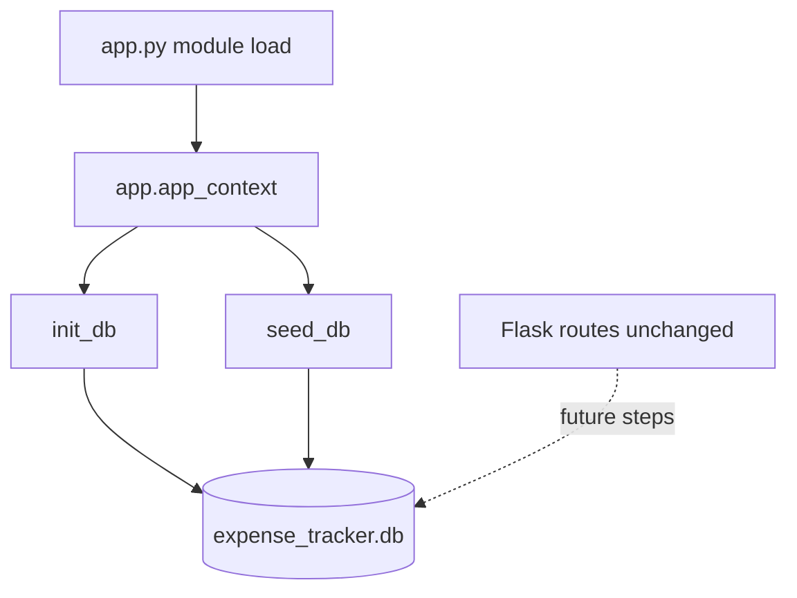

# Step 1: Database Setup — Implementation Plan

## Current state

| File | Status |
|------|--------|
| [`database/db.py`](database/db.py) | 6-line stub with comments only |
| [`app.py`](app.py) | Flask routes only; no DB imports or startup |
| [`expense_tracker.db`](expense_tracker.db) | May exist locally from prior runs (gitignored) |
| Tests | None in repo yet |

Project rules and [`.gitignore`](.gitignore) standardize on **`expense_tracker.db`** at the project root (spec allows `spendly.db` or `expense_tracker.db` — use `expense_tracker.db` for consistency).

**Note:** Git status shows both `database/db.py` and `database\db.py`; on Windows this is usually one file. Implement only [`database/db.py`](database/db.py) under the `database/` package.

---

## Architecture



**Scope (explicit):** No new routes; placeholder routes in `app.py` stay as-is.

---

## 1. Implement `database/db.py`

### Constants and path

- Import: `sqlite3`, `pathlib.Path`, `werkzeug.security.generate_password_hash`
- Resolve DB path relative to project root, e.g. `Path(__file__).resolve().parent.parent / "expense_tracker.db"`

### `get_db()`

- `sqlite3.connect(DATABASE)`
- `conn.row_factory = sqlite3.Row` (dict-like column access)
- `conn.execute("PRAGMA foreign_keys = ON")` on every connection
- Return connection (callers close when done, or use context in `init_db`/`seed_db`)

### `init_db()`

Open connection, run `CREATE TABLE IF NOT EXISTS` for both tables, `commit()`, `close()`.

**`users`:**

```sql
CREATE TABLE IF NOT EXISTS users (
    id INTEGER PRIMARY KEY AUTOINCREMENT,
    name TEXT NOT NULL,
    email TEXT NOT NULL UNIQUE,
    password_hash TEXT NOT NULL,
    created_at TEXT DEFAULT (datetime('now'))
);
```

**`expenses`:**

```sql
CREATE TABLE IF NOT EXISTS expenses (
    id INTEGER PRIMARY KEY AUTOINCREMENT,
    user_id INTEGER NOT NULL,
    amount REAL NOT NULL,
    category TEXT NOT NULL,
    date TEXT NOT NULL,
    description TEXT,
    created_at TEXT DEFAULT (datetime('now')),
    FOREIGN KEY (user_id) REFERENCES users(id)
);
```

- Idempotent: safe to call on every app start
- All future writes use `?` placeholders only

### `seed_db()`

1. `get_db()` → check `SELECT COUNT(*) FROM users`
2. If count > 0 → `close()` and return (no duplicate seed)
3. Else insert demo user with parameterized `INSERT`:
   - `name`: `Demo User`
   - `email`: `demo@spendly.com`
   - `password_hash`: `generate_password_hash("demo123")`
4. Read `user_id` via `cursor.lastrowid`
5. Insert **8 expenses** for that `user_id` — all categories from spec, dates in **May 2026** (current month), `YYYY-MM-DD`

**Suggested seed rows** (amounts in ₹ as REAL):

| category | amount | date | description (optional) |
|----------|--------|------|------------------------|
| Food | 450.00 | 2026-05-03 | Lunch at cafe |
| Transport | 120.00 | 2026-05-05 | Metro recharge |
| Bills | 2499.00 | 2026-05-01 | Electricity bill |
| Health | 650.00 | 2026-05-08 | Pharmacy |
| Entertainment | 399.00 | 2026-05-12 | Movie tickets |
| Shopping | 1899.00 | 2026-05-15 | Groceries |
| Other | 200.00 | 2026-05-10 | Miscellaneous |
| Food | 85.00 | 2026-05-18 | Tea/snacks |

Categories must be exactly: `Food`, `Transport`, `Bills`, `Health`, `Entertainment`, `Shopping`, `Other` (7 categories; Food appears twice to reach 8 rows).

6. `commit()`, `close()`

---

## 2. Wire startup in `app.py`

After `app = Flask(__name__)`:

```python
from database.db import get_db, init_db, seed_db

with app.app_context():
    init_db()
    seed_db()
```

- `get_db` is imported for future steps (spec requires import even if unused here)
- Module-level `app.app_context()` ensures DB is ready when the app module loads (including `python app.py` on port 5001)
- Do **not** modify route handlers or add new routes

---

## 3. Files touched

| File | Action |
|------|--------|
| [`database/db.py`](database/db.py) | Full implementation (~80–120 lines) |
| [`app.py`](app.py) | Import + startup block (~5 lines) |
| `.cursor/plans/01_database_setup.md` | Save this plan (on execution, after approval) |

**No new pip packages** — `sqlite3` + existing `werkzeug`.

---

## 4. Verification (manual)

1. **Fresh DB:** Delete local `expense_tracker.db` (if present), run `python app.py` — file should be created, app starts on port 5001 with no traceback.
2. **Schema:** SQLite CLI or short script:
   - `.tables` → `users`, `expenses`
   - `PRAGMA foreign_key_list(expenses);` shows FK to `users`
3. **Seed once:** `SELECT COUNT(*) FROM users` → 1; `SELECT COUNT(*) FROM expenses` → 8; demo email present; `password_hash` is not plain text.
4. **Seed idempotent:** Restart app twice — row counts unchanged.
5. **Constraints:**
   - Duplicate email insert → `IntegrityError`
   - Expense with invalid `user_id` → FK failure when `PRAGMA foreign_keys = ON`

Optional quick check:

```python
from database.db import get_db
conn = get_db()
print(conn.execute("SELECT email FROM users").fetchone()["email"])
conn.close()
```

---

## 5. Definition of done (from spec)

- [ ] `expense_tracker.db` created on startup
- [ ] `users` and `expenses` tables with correct columns and constraints
- [ ] Demo user with hashed password (`demo@spendly.com` / `demo123` at login in later steps)
- [ ] 8 sample expenses across all 7 categories
- [ ] `seed_db()` does not duplicate on repeated runs
- [ ] App starts without errors; FK enforcement enabled
- [ ] Parameterized SQL only

---

## 6. Out of scope (do not implement now)

- Auth, sessions, login/register POST handlers
- Expense CRUD routes (still stubs)
- ORM / SQLAlchemy
- Automated pytest suite (not in spec for this step)
