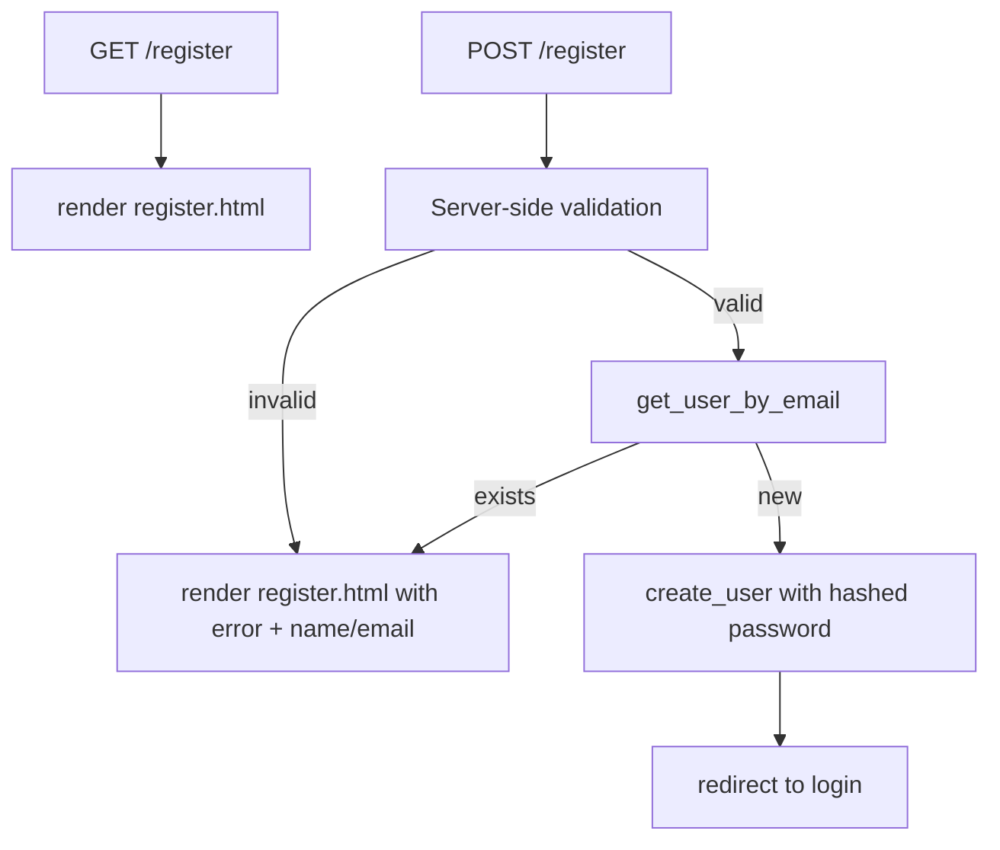

# Step 2: Registration — Implementation Plan

**Spec:** [`.cursor/specs/02-registration.md`](.cursor/specs/02-registration.md)  
**Branch:** `feature/registration`

---

## Current state

| File | Status |
|------|--------|
| [`database/db.py`](database/db.py) | Step 1 complete: `users` table, `get_db()`, `init_db()`, `seed_db()` |
| [`app.py`](app.py) | `GET /register` only — renders template, no POST handling |
| [`templates/register.html`](templates/register.html) | Form exists with `method="POST"` but `action="/register"` hardcoded; no value repopulation |
| [`templates/login.html`](templates/login.html) | GET-only stub; hardcoded `/login` action (unchanged this step) |

Demo user `demo@spendly.com` already exists from seed — use for duplicate-email testing.

---

## Request flow



**Scope:** Registration only. No login POST, sessions, auto-login, or placeholder route changes.

---

## 1. Add DB helpers in [`database/db.py`](database/db.py)

Append two functions using the same `get_db()` / try / commit / close pattern as `seed_db()`.

### `get_user_by_email(email: str)`

- Parameterised query: `SELECT * FROM users WHERE email = ?`
- Pass email already normalised (lowercase) from the route
- Return `sqlite3.Row` if found, else `None`

### `create_user(name: str, email: str, password_hash: str) -> int`

- Parameterised insert: `INSERT INTO users (name, email, password_hash) VALUES (?, ?, ?)`
- `commit()` and return `cursor.lastrowid`
- Caller checks duplicates before insert; SQLite `UNIQUE` on `email` remains a safety net

**Imports in `app.py` (not `db.py`):** `generate_password_hash` stays in route layer; `db.py` already imports it for seed only.

---

## 2. Implement `register` route in [`app.py`](app.py)

### Imports

Add from Flask: `request`, `redirect`, `url_for`  
Add from werkzeug: `generate_password_hash`  
Add from database: `get_user_by_email`, `create_user`

### Route decorator

```python
@app.route("/register", methods=["GET", "POST"])
```

### `GET`

Return `render_template("register.html")` — unchanged layout.

### `POST` handler logic

1. Read and normalise form data:
   - `name` = `request.form.get("name", "").strip()`
   - `email` = `request.form.get("email", "").strip().lower()`
   - `password` = `request.form.get("password", "")` (do not strip — spaces may be intentional)

2. Validate in order (first failing message wins):

   | Check | Error message (example) |
   |-------|-------------------------|
   | `name` non-empty | "Please enter your full name." |
   | Email contains `@` and a `.` in the domain part | "Please enter a valid email address." |
   | `len(password) >= 8` | "Password must be at least 8 characters." |
   | `get_user_by_email(email)` is `None` | "An account with this email already exists." |

   Keep validation in a small inline block or a private helper in `app.py` — no new modules.

3. **Success:** `create_user(name, email, generate_password_hash(password))` then `return redirect(url_for("login"))`

4. **Failure:** `return render_template("register.html", error=error, name=name, email=email)`

### Flash messages

Spec allows optional flash on success. **Defer flash** for this step: showing it would require editing [`login.html`](templates/login.html), which the spec excludes ("No changes to login/logout behaviour beyond redirect target"). Plain redirect to login is sufficient.

### Do not add

- `app.secret_key` / sessions (Step 3)
- Changes to `/login`, `/logout`, or expense stubs

---

## 3. Update [`templates/register.html`](templates/register.html)

| Change | Detail |
|--------|--------|
| Form action | `action="{{ url_for('register') }}"` |
| Name input | `value="{{ name or '' }}"` |
| Email input | `value="{{ email or '' }}"` |
| Password input | No `value` (never repopulate password) |
| Error block | Keep existing `` / `.auth-error` |

Preserve `required`, placeholders, and CSS classes — no stylesheet changes.

---

## 4. Files touched

| File | Action |
|------|--------|
| [`database/db.py`](database/db.py) | Add `get_user_by_email`, `create_user` (~25–35 lines) |
| [`app.py`](app.py) | Extend `register` for GET/POST + validation (~35–50 lines) |
| [`templates/register.html`](templates/register.html) | `url_for` action + field values (~3 lines) |

**No new files, pip packages, or schema migrations.**

---

## 5. Manual verification

1. **App start:** `python app.py` — port 5001, no traceback.
2. **GET:** Open `/register` — form looks unchanged.
3. **Happy path:** Register `test.user@example.com` / password `password123` / name `Test User` → redirect to `/login`; confirm row in DB with non-plain `password_hash`.
4. **Validation errors:**
   - Empty name → error, name/email preserved if typed
   - Invalid email → error
   - Password `short` → error
5. **Duplicate:** Register `demo@spendly.com` → duplicate message, no second row.
6. **Form action:** View page source — POST target is `/register` via Flask routing (not hardcoded string in template).
7. **Regression:** `/login` still renders; placeholder routes unchanged.

Optional DB check:

```python
from database.db import get_db
conn = get_db()
print(conn.execute("SELECT email, password_hash FROM users WHERE email = ?", ("test.user@example.com",)).fetchone())
conn.close()
```

---

## 6. Definition of done (from spec)

- [ ] `GET /register` renders unchanged layout
- [ ] Valid POST inserts user with hashed password
- [ ] Success redirects to login
- [ ] Invalid POST shows `error` and preserves name/email
- [ ] Duplicate email blocked with clear message
- [ ] Form uses `url_for('register')`
- [ ] App starts on port 5001 without errors
- [ ] Login/logout stubs unchanged

---

## 7. Out of scope

- Login POST and session auth (Step 3)
- Flash/success banner on login page
- Profile, expenses, navbar auth state
- CSS / `login.html` changes
- Automated pytest (not in spec)
