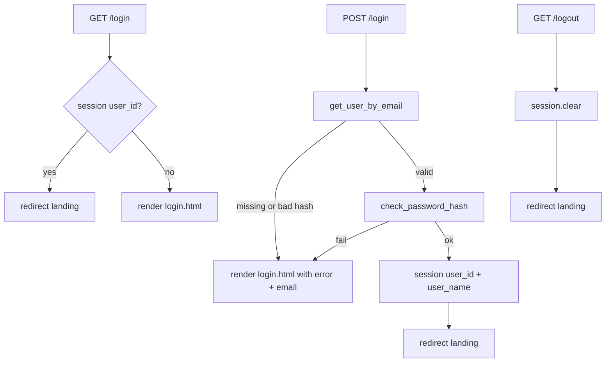

# Step 3: Login and Logout — Implementation Plan

**Spec:** [`.cursor/specs/03-login-logout.md`](.cursor/specs/03-login-logout.md)  
**Branch:** `feature/login-logout`

---

## Current state

| File | Status |
|------|--------|
| [`database/db.py`](database/db.py) | Step 1–2 complete: schema, `get_user_by_email`, `create_user`; demo user `demo@spendly.com` / `demo123` from seed |
| [`app.py`](app.py) | Registration GET/POST done; `login` is GET-only; `logout` returns placeholder string |
| [`templates/login.html`](templates/login.html) | Form with `method="POST"` but `action="/login"` hardcoded; `` ready; email not repopulated |
| [`templates/base.html`](templates/base.html) | Static navbar: always “Sign in” + “Get started” |
| [`templates/register.html`](templates/register.html) | Complete — no changes this step |

**Scope:** Login POST, sessions, logout, navbar auth state. No profile, expenses, `@login_required`, flash messages, or CSS file changes.

---

## Request flow



---

## 1. Configure sessions in [`app.py`](app.py)

### Imports

Add from Flask: `session`  
Add from werkzeug: `check_password_hash` (keep existing `generate_password_hash` for register)  
Add from `os`: `environ` (or `import os`)

### Secret key

After `app = Flask(__name__)`:

```python
app.secret_key = os.environ.get("SECRET_KEY", "dev-only-change-me")
```

Use a short comment that production must set `SECRET_KEY` in the environment. Required before any `session[...]` access.

### Session payload (minimal)

On successful login, set:

- `session["user_id"]` — `user["id"]` from the row
- `session["user_name"]` — `user["name"]` for navbar (avoids `get_user_by_id` and extra queries)

**Do not add** `get_user_by_id` in [`database/db.py`](database/db.py) unless you later need to re-validate a stale session; storing `user_name` at login satisfies the spec.

### Small helper (optional, in `app.py`)

```python
def _current_user_id():
    return session.get("user_id")
```

Use for “already logged in” checks on `GET /login`.

---

## 2. Implement `login` route in [`app.py`](app.py)

### Route decorator

```python
@app.route("/login", methods=["GET", "POST"])
```

### `GET`

- If `session.get("user_id")`: `return redirect(url_for("landing"))`
- Else: `return render_template("login.html")`

### `POST`

1. Read form:
   - `email` = `request.form.get("email", "").strip().lower()`
   - `password` = `request.form.get("password", "")` (do not strip)

2. Lookup: `user = get_user_by_email(email)`

3. Authenticate:
   - Valid only if `user` is not `None` **and** `check_password_hash(user["password_hash"], password)`
   - On failure: single message `"Invalid email or password."` (same for unknown email and wrong password)

4. **Success:**
   ```python
   session["user_id"] = user["id"]
   session["user_name"] = user["name"]
   return redirect(url_for("landing"))
   ```

5. **Failure:** `return render_template("login.html", error=error, email=email)`

Reuse `_is_valid_email` only if you want format validation before DB lookup; spec does not require it—invalid format can fall through to generic credential error.

### Do not change

- [`register`](app.py) route logic (except shared imports)
- Placeholder routes `/profile`, `/expenses/...`

---

## 3. Replace `logout` in [`app.py`](app.py)

Move `/logout` out of the “placeholder” comment block (it is real in Step 3).

```python
@app.route("/logout")
def logout():
    session.clear()
    return redirect(url_for("landing"))
```

Safe when not logged in (`session.clear()` is a no-op).

---

## 4. Update [`templates/login.html`](templates/login.html)

Mirror [`templates/register.html`](templates/register.html) patterns:

| Change | Detail |
|--------|--------|
| Form action | `action="{{ url_for('login') }}"` |
| Email input | `value="{{ email or '' }}"` |
| Password input | No `value` (never repopulate) |
| Error block | Keep existing `` / `.auth-error` |

Preserve `required`, placeholders, and CSS classes.

---

## 5. Update [`templates/base.html`](templates/base.html)

Replace static `.nav-links` with conditional auth UI using Flask’s `session` (available in Jinja without extra context processor):

```jinja
<div class="nav-links">
    
        <span class="nav-user">{{ session.get('user_name', 'Account') }}</span>
        <a href="{{ url_for('logout') }}">Log out</a>
    
        <a href="{{ url_for('login') }}">Sign in</a>
        <a href="{{ url_for('register') }}" class="nav-cta">Get started</a>
    
</div>
```

Use a `<span>` for the display name (not a link). Reuse existing `.nav-links` / `.nav-cta` classes; **no new CSS** unless the name needs spacing—in that case append a minimal rule in [`static/css/style.css`](static/css/style.css) using existing tokens (e.g. `.nav-user { color: var(--ink-muted); }`). Prefer no stylesheet change if default link styling is acceptable for a text span.

---

## 6. Files touched

| File | Action |
|------|--------|
| [`app.py`](app.py) | `secret_key`, extend `login` (GET/POST + session), implement `logout` (~40–55 lines) |
| [`templates/login.html`](templates/login.html) | `url_for` action + email `value` (~2 lines) |
| [`templates/base.html`](templates/base.html) | Conditional navbar (~8–12 lines) |

**No changes:** [`database/db.py`](database/db.py) (reuse `get_user_by_email` only), new files, pip packages, schema.

---

## 7. Manual verification

1. **App start:** `python app.py` — port 5001, no traceback.
2. **GET `/login`:** Form layout unchanged; view source shows `action` via Flask (`/login` from routing, not hardcoded in template).
3. **Happy path:** Sign in `demo@spendly.com` / `demo123` → redirect to `/`; navbar shows “Demo User” (or name from seed) and “Log out”.
4. **Wrong password:** Same email, bad password → error “Invalid email or password.”, email field preserved.
5. **Unknown email:** `nobody@example.com` → same generic error (no “user not found” wording).
6. **Logged-in guard:** While session active, open `/login` → redirect to landing.
7. **Logout:** Click “Log out” → landing; navbar back to “Sign in” / “Get started”; `/logout` no longer returns stub text.
8. **Regression:** `/register` still works; `/profile` and expense stubs unchanged.

Optional session check in browser devtools: cookie set after login, cleared after logout.

---

## 8. Definition of done (from spec)

- [ ] `GET /login` renders unchanged layout
- [ ] Valid POST (`demo@spendly.com` / `demo123`) sets session and redirects to landing
- [ ] Navbar shows logged-in name and “Log out” after login
- [ ] `GET /logout` clears session and restores logged-out navbar
- [ ] Invalid POST shows generic error and preserved email
- [ ] Logged-in `GET /login` redirects to landing
- [ ] Form uses `url_for('login')`
- [ ] `/logout` stub removed
- [ ] App starts on port 5001 without errors
- [ ] `/profile` and `/expenses/...` placeholders unchanged

---

## 9. Out of scope

- Profile page and protected routes (Step 4+)
- `@login_required` decorator or `before_request` global auth
- Flash messages on login success
- `get_user_by_id`, session refresh, or “remember me”
- Register flow changes
- Automated pytest (not in spec)
- Landing page hero CTA changes for logged-in users
