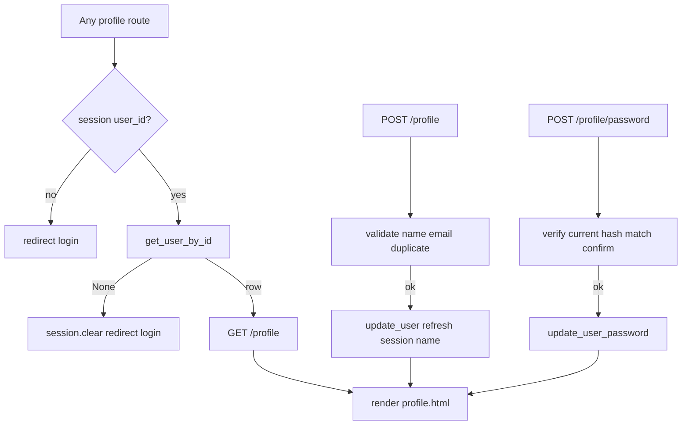

# Step 4: Profile — Implementation Plan

**Spec:** [`.cursor/specs/04-profile.md`](.cursor/specs/04-profile.md)  
**Branch:** `feature/profile`

---

## Current state

| File | Status |
|------|--------|
| [`database/db.py`](database/db.py) | Has `get_user_by_email`, `create_user`; **no** `get_user_by_id` / update helpers |
| [`app.py`](app.py) | Login/logout + sessions (`user_id`, `user_name`); `/profile` returns stub string |
| [`templates/base.html`](templates/base.html) | Logged-in navbar: `<span class="nav-user">` (not linked) + Log out |
| [`static/css/style.css`](static/css/style.css) | Auth + marketing styles only; **no** `.page-header-*` / app-page classes |
| [`templates/login.html`](templates/login.html), [`register.html`](templates/register.html) | Patterns to mirror for forms, errors, field repopulation |

**Scope:** Profile page, route protection, DB updates, navbar link, app-page CSS. No expense routes, no global `before_request` auth, no login redirect change.

---

## Request flow



---

## 1. Database helpers in [`database/db.py`](database/db.py)

Add three functions after `create_user` (same connection pattern as existing helpers):

### `get_user_by_id(user_id)`

```python
def get_user_by_id(user_id):
    db = get_db()
    try:
        return db.execute(
            "SELECT * FROM users WHERE id = ?",
            (user_id,),
        ).fetchone()
    finally:
        db.close()
```

### `update_user(user_id, name, email)`

```python
def update_user(user_id, name, email):
    db = get_db()
    try:
        db.execute(
            "UPDATE users SET name = ?, email = ? WHERE id = ?",
            (name, email, user_id),
        )
        db.commit()
    finally:
        db.close()
```

### `update_user_password(user_id, password_hash)`

```python
def update_user_password(user_id, password_hash):
    db = get_db()
    try:
        db.execute(
            "UPDATE users SET password_hash = ? WHERE id = ?",
            (password_hash, user_id),
        )
        db.commit()
    finally:
        db.close()
```

**No schema changes.**

---

## 2. Auth helpers and decorator in [`app.py`](app.py)

### Imports

- `functools.wraps`
- From `database.db`: add `get_user_by_id`, `update_user`, `update_user_password`

### `login_required` decorator

```python
def login_required(view):
    @wraps(view)
    def wrapped(*args, **kwargs):
        if not session.get("user_id"):
            return redirect(url_for("login"))
        return view(*args, **kwargs)
    return wrapped
```

Apply only to profile views (not register/login/landing).

### `_get_current_user()`

Centralize stale-session handling:

```python
def _get_current_user():
    user_id = session.get("user_id")
    if not user_id:
        return None
    user = get_user_by_id(user_id)
    if user is None:
        session.clear()
    return user
```

Each protected handler: `user = _get_current_user()` then `if user is None: return redirect(url_for("login"))`.

Reuse existing `_is_valid_email(email)` from register.

### Member-since display helper (optional, in `app.py`)

```python
def _format_member_since(created_at):
    if not created_at:
        return ""
    # SQLite default: "YYYY-MM-DD HH:MM:SS" — show date portion or simple readable form
    return created_at[:10]
```

Pass `member_since=_format_member_since(user["created_at"])` into template.

---

## 3. Profile routes in [`app.py`](app.py)

Move `/profile` out of the placeholder block. Remove stub `return "Profile page — coming in Step 4"`.

### Shared render helper (recommended)

```python
def _render_profile(user, **kwargs):
    return render_template(
        "profile.html",
        user=user,
        name=kwargs.get("name", user["name"]),
        email=kwargs.get("email", user["email"]),
        member_since=_format_member_since(user["created_at"]),
        profile_error=kwargs.get("profile_error"),
        profile_success=kwargs.get("profile_success"),
        password_error=kwargs.get("password_error"),
        password_success=kwargs.get("password_success"),
    )
```

Separate message keys avoid one form’s error overwriting the other.

### `profile` — `GET` and `POST` on `/profile`

```python
@app.route("/profile", methods=["GET", "POST"])
@login_required
def profile():
    user = _get_current_user()
    if user is None:
        return redirect(url_for("login"))

    if request.method == "GET":
        return _render_profile(user)

    # POST — update name/email
    name = request.form.get("name", "").strip()
    email = request.form.get("email", "").strip().lower()

    if not name:
        return _render_profile(user, name=name, email=email, profile_error="Please enter your full name.")
    if not _is_valid_email(email):
        return _render_profile(user, name=name, email=email, profile_error="Please enter a valid email address.")

    existing = get_user_by_email(email)
    if existing and existing["id"] != user["id"]:
        return _render_profile(
            user, name=name, email=email,
            profile_error="An account with this email already exists.",
        )

    update_user(user["id"], name, email)
    session["user_name"] = name
    user = get_user_by_id(user["id"])  # refresh row for template
    return _render_profile(
        user,
        profile_success="Profile updated successfully.",
    )
```

### `profile_password` — `POST` only on `/profile/password`

```python
@app.route("/profile/password", methods=["POST"])
@login_required
def profile_password():
    user = _get_current_user()
    if user is None:
        return redirect(url_for("login"))

    current = request.form.get("current_password", "")
    new_password = request.form.get("new_password", "")
    confirm = request.form.get("confirm_password", "")

    if not check_password_hash(user["password_hash"], current):
        return _render_profile(user, password_error="Current password is incorrect.")
    if len(new_password) < 8:
        return _render_profile(user, password_error="New password must be at least 8 characters.")
    if new_password != confirm:
        return _render_profile(user, password_error="New passwords do not match.")

    update_user_password(user["id"], generate_password_hash(new_password))
    user = get_user_by_id(user["id"])
    return _render_profile(user, password_success="Password updated successfully.")
```

**Do not change** login redirect (still `landing` after sign-in).

---

## 4. Create [`templates/profile.html`](templates/profile.html)

Follow [`.cursor/skills/frontend-design/SKILL.md`](.cursor/skills/frontend-design/SKILL.md) app-page archetype.

### Structure

- ``
- Title: `Your profile — Spendly`
- `page-header-section`: title “Your profile”, subtitle “Manage your account”
- `page-body` with **two** `data-card` sections (stacked):

**Card 1 — Account details**

- Read-only line: **Member since** `{{ member_since }}`
- `` / `` using `.auth-error` and `.auth-success`
- Form: `method="POST"` `action="{{ url_for('profile') }}"`
- Fields: `name`, `email` with `value="{{ name }}"` / `value="{{ email }}"`
- Submit: `btn-submit` — “Save changes”

**Card 2 — Change password**

- Separate `` / ``
- Form: `method="POST"` `action="{{ url_for('profile_password') }}"`
- Fields: `current_password`, `new_password`, `confirm_password` (type password, no repopulation)
- Submit: “Update password”

Reuse `.form-group`, `.form-input` from auth pages.

---

## 5. Update [`templates/base.html`](templates/base.html)

Replace the logged-in name span with a link:

```jinja
<a href="{{ url_for('profile') }}" class="nav-user">{{ session.get('user_name', 'Account') }}</a>
```

Append minimal CSS so `.nav-user` as `<a>` keeps muted color and no underline until hover.

---

## 6. CSS in [`static/css/style.css`](static/css/style.css)

Append app-page shared styles and profile-specific rules (`.profile-meta`, `.profile-card-title`, `.auth-success`, etc.). Use tokens only.

---

## 7. Files touched (implementation order)

| Order | File | Action |
|-------|------|--------|
| 1 | [`database/db.py`](database/db.py) | Add `get_user_by_id`, `update_user`, `update_user_password` |
| 2 | [`app.py`](app.py) | Decorator, helpers, `profile` + `profile_password`; remove stub |
| 3 | [`static/css/style.css`](static/css/style.css) | App-page + profile + `.auth-success` |
| 4 | [`templates/profile.html`](templates/profile.html) | **Create** |
| 5 | [`templates/base.html`](templates/base.html) | Profile link in navbar |

**No changes:** expense placeholders, register/login logic (except shared imports), pip packages, schema.

---

## 8. Manual verification

1. `python app.py` — port 5001, no traceback.
2. Logged out: `GET /profile` → redirect to `/login`.
3. Log in `demo@spendly.com` / `demo123` → open `/profile` → see name, email, member since.
4. Update name → success message; navbar name updates.
5. Change email to unused address → success; sign in with new email works.
6. Set email to another user’s address → error, no DB change.
7. Change password with wrong current → error; old password still works.
8. Change password with valid current + matching new (≥8 chars) → success; login with new password works.
9. Navbar name links to `/profile`.
10. `/expenses/add` still returns stub text.

---

## 9. Definition of done (from spec)

- [ ] Unauthenticated `GET /profile` redirects to login
- [ ] Logged-in `GET /profile` shows name, email, member since
- [ ] Valid `POST /profile` updates DB and shows success; navbar name updates
- [ ] Duplicate email on `POST /profile` shows error without update
- [ ] Valid `POST /profile/password` updates hash; new password works at login
- [ ] Wrong current password shows error; hash unchanged
- [ ] Navbar links to profile when logged in
- [ ] `/profile` stub removed
- [ ] Forms use `url_for`
- [ ] App starts on port 5001
- [ ] Expense placeholders unchanged

---

## 10. Out of scope

- Expense CRUD routes and list UI (Steps 7+)
- Global `@login_required` on all future routes (add per route as steps land)
- Flash messages / `?next=` redirect after login
- Email change verification flow
- Profile photo, account deletion, 2FA
- Automated pytest
- Changing post-login redirect from landing to profile
